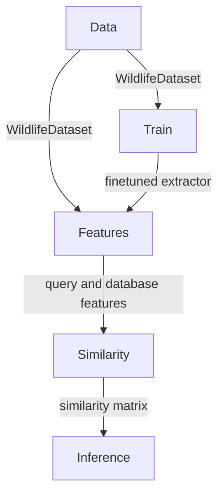

<p align="center">
  <a href="https://github.com/WildlifeDatasets/wildlife-tools/issues"></a>
  <a href="https://github.com/WildlifeDatasets/wildlife-tools/pulls"></a>
  <a href="https://github.com/WildlifeDatasets/wildlife-tools/graphs/contributors"></a>
  <a href="https://github.com/WildlifeDatasets/wildlife-tools/network/members"></a>
  <a href="https://github.com/WildlifeDatasets/wildlife-tools/stargazers"></a>
  <a href="https://github.com/WildlifeDatasets/wildlife-tools/watchers"></a>
  <a href="https://github.com/WildlifeDatasets/wildlife-tools/blob/main/LICENSE"></a>
</p>

<div align="center">
  
  <p align="center">A tool-kit for Wildlife Individual Identification that provides a wide variety of pre-trained models for inference and fine-tuning.</p>
  <a href="https://wildlifedatasets.github.io/wildlife-tools/">Documentation</a>
  ·
  <a href="https://huggingface.co/BVRA/MegaDescriptor-L-384">MegaDescriptor</a>
  ·
  <a href="https://github.com/WildlifeDatasets/wildlife-tools/issues/new?assignees=aerodynamic-sauce-pan&labels=bug&projects=&template=bug_report.md&title=%5BBUG%5D">Report Bug</a>
  ·
  <a href="https://github.com/WildlifeDatasets/wildlife-tools/issues/new?assignees=aerodynamic-sauce-pan&labels=enhancement&projects=&template=enhancement.md&title=%5BEnhancement%5D">Request Feature</a>
  <h1></h1>
</div>


# Introduction
The `wildlife-tools` library offers a simple interface for various tasks in the Wildlife Re-Identification domain. It covers use cases such as training, feature extraction, similarity calculation, image retrieval, and classification. It complements the `wildlife-datasets` library, which acts as dataset repository. All datasets there can be used in combination with `WildlifeDataset` component, which serves for loading extracting images and image tensors other tasks. 

More information can be found in [Documentation](https://wildlifedatasets.github.io/wildlife-tools/)

## Installation

To install `wildlife-tools`, you can build it from scratch or use pre-build Pypi package.


### Using Pypi

```script
pip install wildlife-tools

```

### Building from scratch

Clone the repository using `git` and install it.
```script
git clone git@github.com:WildlifeDatasets/wildlife-tools.git

cd wildlife-tools
pip install -e .
```


## Modules in the in the `wildlife-tools`

- The `data` module provides tools for creating instances of the `WildlifeDataset`.
- The `train` module offers tools for fine-tuning feature extractors on the `WildlifeDataset`.
- The `features` module provides tools for extracting features from the `WildlifeDataset` using various extractors.
- The `similarity` module provides tools for constructing a similarity matrix from query and database features.
- The `inference` module offers tools for creating predictions using the similarity matrix.


## Relations between modules:




## Example
### 1. Create `WildlifeDataset` 
Using metadata from `wildlife-datasets`, create `WildlifeDataset` object for the StripeSpotter dataset.

```Python
from wildlife_datasets.datasets import StripeSpotter
from wildlife_datasets import datasets
from wildlife_tools.data import WildlifeDataset
import torchvision.transforms as T

datasets.StripeSpotter.get_data('datasets/StripeSpotter')
metadata = StripeSpotter('datasets/StripeSpotter')
transform = T.Compose([T.Resize([224, 224]), T.ToTensor()])
dataset = WildlifeDataset(metadata.df, metadata.root, transform=transform)
```

Optionally, split metadata into subsets. In this example, query is first 100 images and rest are in database.

```Python
database = WildlifeDataset(metadata.df.iloc[100:,:], metadata.root, transform=transform)
query = WildlifeDataset(metadata.df.iloc[:100,:], metadata.root, transform=transform)
```

### 2. Extract features
Extract features using MegaDescriptor Tiny, downloaded from HuggingFace hub.

```Python
from wildlife_tools.features import DeepFeatures
import timm

name = 'hf-hub:BVRA/MegaDescriptor-T-224'
extractor = DeepFeatures(timm.create_model(name, num_classes=0, pretrained=True))
query, database = extractor(query), extractor(database)
```

### 3. Calculate similarity
Calculate cosine similarity between query and database deep features.

```Python
from wildlife_tools.similarity import CosineSimilarity

similarity_function = CosineSimilarity()
similarity = similarity_function(query, database)
```


### 4. Evaluate
Use the cosine similarity in nearest neigbour classifier and get predictions.

```Python
from wildlife_tools.inference import KnnClassifier

classifier = KnnClassifier(k=1, database_labels=database.labels_string)
predictions = classifier(similarity['cosine'])
```
