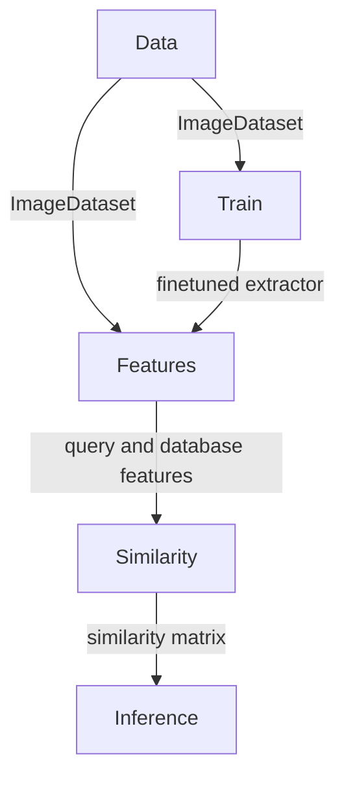

<p align="center">
  <a href="https://github.com/WildlifeDatasets/wildlife-tools/issues"></a>
  <a href="https://github.com/WildlifeDatasets/wildlife-tools/pulls"></a>
  <a href="https://github.com/WildlifeDatasets/wildlife-tools/graphs/contributors"></a>
  <a href="https://github.com/WildlifeDatasets/wildlife-tools/network/members"></a>
  <a href="https://github.com/WildlifeDatasets/wildlife-tools/stargazers"></a>
  <a href="https://github.com/WildlifeDatasets/wildlife-tools/watchers"></a>
  <a href="https://github.com/WildlifeDatasets/wildlife-tools/blob/main/LICENSE"></a>
</p>

<p align="center">

</p>

<div align="center">
  
  <p align="center">A toolkit for Animal Individual Identification that covers use cases such as training, feature extraction, similarity calculation, image retrieval, and classification.</p>

  <a href="https://wildlifedatasets.github.io/wildlife-tools/">Documentation</a>
  ·
  <a href="https://github.com/WildlifeDatasets/wildlife-tools/issues/new?assignees=aerodynamic-sauce-pan&labels=bug&projects=&template=bug_report.md&title=%5BBUG%5D">Report Bug</a>
  ·
  <a href="https://github.com/WildlifeDatasets/wildlife-tools/issues/new?assignees=aerodynamic-sauce-pan&labels=enhancement&projects=&template=enhancement.md&title=%5BEnhancement%5D">Request Feature</a>
</div>

</br >

## Our other projects

| <a href="https://github.com/WildlifeDatasets/wildlife-datasets"></a>  | <a href="https://huggingface.co/BVRA/MegaDescriptor-L-384"></a> | <a href="https://github.com/WildlifeDatasets/wildlife-tools"></a> |
|:--------------:|:-----------:|:------------:|
| Datasets for identification of individual animals | Trained model for individual re&#x2011;identification  | Tools for training re&#x2011;identification models |

</br>

# Introduction
The `wildlife-tools` library offers a simple interface for various tasks in the Wildlife Re-Identification domain. It covers use cases such as training, feature extraction, similarity calculation, image retrieval, and classification. It complements the `wildlife-datasets` library, which acts as dataset repository.

More information can be found in [Documentation](https://wildlifedatasets.github.io/wildlife-tools/)

## What's New
Here’s a summary of recent updates and changes.


- **Expanded Functionality:** Local feature matching is done using [gluefactory](https://github.com/cvg/glue-factory) 
    - Feature extraction methods: SuperPoint, ALIKED, DISK, SIFT features
    - Matching method: LightGlue, More efficient LoFTR
- **New Feature:** Introduced WildFusion (https://arxiv.org/abs/2408.12934), calibrated score fusion for high-accuracy animal reidentification. Added calibration methods.
- **Bug Fixes:** Resolved issues with knn and ranking inference methods and many more.


## Installation

To install `wildlife-tools`, you can build it from scratch or use pre-build Pypi package.


### Using Pypi

```script
pip install wildlife-tools
```

### Building from scratch

Clone the repository using `git` and install it.
```script
git clone git@github.com:WildlifeDatasets/wildlife-tools.git

cd wildlife-tools
pip install -e .
```


## Modules in the in the `wildlife-tools`

- The `data` module provides tools for creating instances of the `ImageDataset`.
- The `train` module offers tools for fine-tuning feature extractors on the `ImageDataset`.
- The `features` module provides tools for extracting features from the `ImageDataset` using various extractors.
- The `similarity` module provides tools for constructing a similarity matrix from query and database features.
- The `inference` module offers tools for creating predictions using the similarity matrix.


## Relations between modules:




## Example
### 1. Create `ImageDataset` 
Using metadata from `wildlife-datasets`, create `ImageDataset` object for the MacaqueFaces dataset.

```Python
from wildlife_datasets.datasets import MacaqueFaces
from wildlife_tools.data import ImageDataset
import torchvision.transforms as T

metadata = MacaqueFaces('datasets/MacaqueFaces')
transform = T.Compose([T.Resize([224, 224]), T.ToTensor(), T.Normalize(mean=(0.485, 0.456, 0.406), std=(0.229, 0.224, 0.225))])
dataset = ImageDataset(metadata.df, metadata.root, transform=transform)
```

Optionally, split metadata into subsets. In this example, query is first 100 images and rest are in database.

```Python
dataset_database = ImageDataset(metadata.df.iloc[100:,:], metadata.root, transform=transform)
dataset_query = ImageDataset(metadata.df.iloc[:100,:], metadata.root, transform=transform)
```

### 2. Extract features
Extract features using MegaDescriptor Tiny, downloaded from HuggingFace hub.

```Python
import timm
from wildlife_tools.features import DeepFeatures

name = 'hf-hub:BVRA/MegaDescriptor-T-224'
extractor = DeepFeatures(timm.create_model(name, num_classes=0, pretrained=True))
query, database = extractor(dataset_query), extractor(dataset_database)
```

### 3. Calculate similarity
Calculate cosine similarity between query and database deep features.

```Python
from wildlife_tools.similarity import CosineSimilarity

similarity_function = CosineSimilarity()
similarity = similarity_function(query, database)
```


### 4. Evaluate
Use the cosine similarity in nearest neigbour classifier and get predictions.

```Python
import numpy as np
from wildlife_tools.inference import KnnClassifier

classifier = KnnClassifier(k=1, database_labels=dataset_database.labels_string)
predictions = classifier(similarity['cosine'])
accuracy = np.mean(dataset_database.labels_string == predictions)
```

## Citation

If you like our package, please cite us.

```
@InProceedings{Cermak_2024_WACV,
    author    = {\v{C}erm\'ak, Vojt\v{e}ch and Picek, Luk\'a\v{s} and Adam, Luk\'a\v{s} and Papafitsoros, Kostas},
    title     = {{WildlifeDatasets: An Open-Source Toolkit for Animal Re-Identification}},
    booktitle = {Proceedings of the IEEE/CVF Winter Conference on Applications of Computer Vision (WACV)},
    month     = {January},
    year      = {2024},
    pages     = {5953-5963}
}
```

```
@article{cermak2024wildfusion,
  title={WildFusion: Individual animal identification with calibrated similarity fusion},
  author={Cermak, Vojt{\v{e}}ch and Picek, Lukas and Adam, Luk{\'a}{\v{s}} and Neumann, Luk{\'a}{\v{s}} and Matas, Ji{\v{r}}{\'\i}},
  journal={arXiv preprint arXiv:2408.12934},
  year={2024}
}
```

