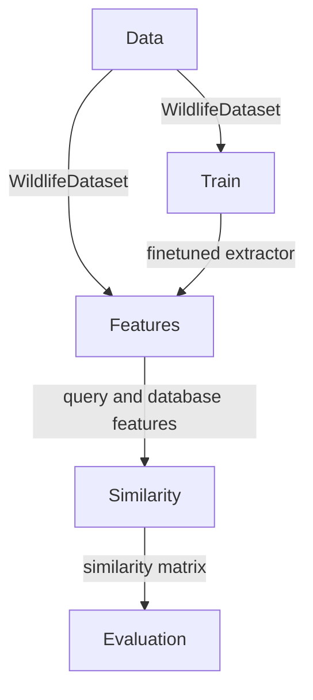

# Introduction
The `wildlife-tools` library offers a simple interface for various tasks in the Wildlife Re-Identification domain. It covers use cases such as training, feature extraction, similarity calculation, image retrieval, and classification. It complements the `wildlife-datasets` library, which acts as dataset repository. All datasets there can be used in combination with `WildlifeDataset` component, which serves for loading extracting images and image tensors other tasks. 

More information can be found in [Documentation](https://wildlifedatasets.github.io/wildlife-tools/)


## Modules in the in the `wildlife-tools`

- The `data` module provides tools for creating instances of the `WildlifeDataset`.
- The `train` module offers tools for fine-tuning feature extractors on the `WildlifeDataset`.
- The `features` module provides tools for extracting features from the `WildlifeDataset` using various extractors.
- The `similarity` module provides tools for constructing a similarity matrix from query and database features.
- The `evaluation` module offers tools for creating and evaluating predictions using the similarity matrix.


## Relations between modules:




## Example
### 1. Create `WildlifeDataset` 
Using metadata dataframes, create `WildlifeDataset` instances for both query and database.

```Python
dataset_folder = 'ExampleDataset'
metadata_database = pd.read_csv('metadata_database.csv')
metadata_query = pd.read_csv('metadata_query.csv')

transform = T.Compose([T.Resize([224, 224]), T.ToTensor()])
database = WildlifeDataset(metadata_database, dataset_folder, transform)
query = WildlifeDataset(metadata_query, dataset_folder, transform)
```

### 2. Extract features
Extract features using MegaDescriptor Tiny, downloaded from HuggingFace hub.

```Python
name = 'hf-hub:BVRA/MegaDescriptor-T-224'
extractor = DeepFeatures(timm.create_model(name, num_classes=0, pretrained=True))
query, database = extractor(dataset_query), extractor(dataset_database)
```

### 3. Calculate similarity
Calculate cosine similarity between query and database deep features.

```Python
similarity_function = CosineSimilarity()
similarity = similarity_function(query, database)

```


### 4. Evaluate
Use the cosine similarity in nearest neigbour classifier and get predictions.

```Python
classifier = KnnClassifier(k=1)
predictions = classifier(similarity['cosine'])
```


## Installation

```shell
pip install wildlife-tools
```


Following dependencies were used:

```
torch==2.0.1
pytorch-metric-learning==1.6.0
faiss-gpu==1.7.2
pycocotools==2.0.4
timm==0.9.2
```
