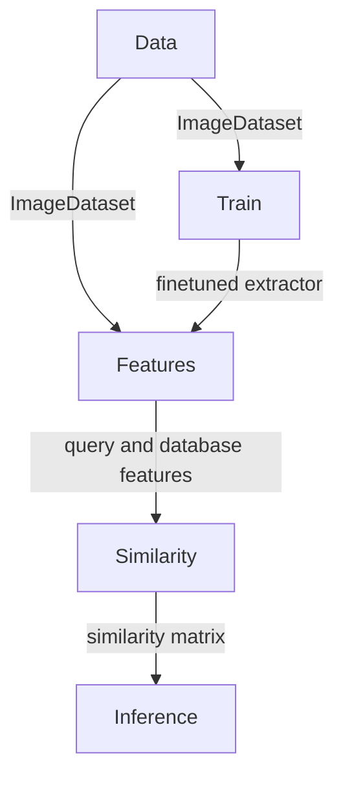

# Introduction

The `wildlife-tools` library offers a simple interface for various tasks in the wildlife re-identification domain. Its main features are:

- It covers use cases such as training, feature extraction, similarity calculation, image retrieval, and classification.
- It provides traning codes and usage examples for our models [MegaDescriptor](./megadescriptor.md) and [WildFusion](./wildfusion.md).
- It complements the [WildlifeDatasets](https://github.com/WildlifeDatasets/wildlife-datasets) library, which acts as dataset repository.


## Installation

Install `wildlife-tools` using `pip`

```script
pip install git+https://github.com/WildlifeDatasets/wildlife-tools
```

or clone the repository using `git` and install it.

```script
git clone git@github.com:WildlifeDatasets/wildlife-tools.git

cd wildlife-tools
pip install -e .
```


## Modules in the in the `wildlife-tools`

- The `data` module provides tools for creating instances of datasets.
- The `train` module offers tools for fine-tuning feature extractors.
- The `features` module provides tools for extracting features using various extractors.
- The `similarity` module provides tools for constructing a similarity matrix from query and database features.
- The `inference` module offers tools for creating predictions using the similarity matrix.


## Relations between modules



## Citation

If you like our package, please cite us.

```
@InProceedings{Cermak_2024_WACV,
    author    = {\v{C}erm\'ak, Vojt\v{e}ch and Picek, Luk\'a\v{s} and Adam, Luk\'a\v{s} and Papafitsoros, Kostas},
    title     = {{WildlifeDatasets: An Open-Source Toolkit for Animal Re-Identification}},
    booktitle = {Proceedings of the IEEE/CVF Winter Conference on Applications of Computer Vision (WACV)},
    month     = {January},
    year      = {2024},
    pages     = {5953-5963}
}
```

```
@article{cermak2024wildfusion,
  title={WildFusion: Individual animal identification with calibrated similarity fusion},
  author={Cermak, Vojt{\v{e}}ch and Picek, Lukas and Adam, Luk{\'a}{\v{s}} and Neumann, Luk{\'a}{\v{s}} and Matas, Ji{\v{r}}{\'\i}},
  journal={arXiv preprint arXiv:2408.12934},
  year={2024}
}
```
